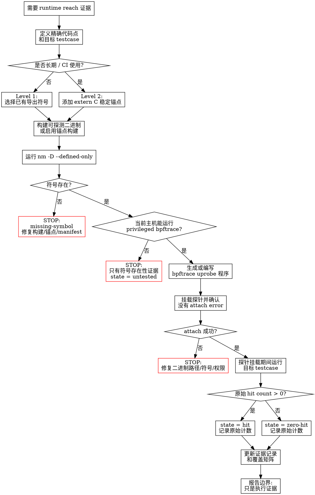

# cn_verify_testcase_runtime_reach

## 必需工具（先运行）

进入流程图前，先检查当前主机有哪些必需工具存在，并把结果记录到证据里。缺少
`bpftrace` 时，只能做符号存在性检查；这不能证明 runtime reach。

| 工具 / 包 | 用途 | 存在性检查 |
|---|---|---|
| 支持 uprobe 的 Linux | `bpftrace` uprobe 挂载 | `test "$(uname -s)" = Linux` |
| `bpftrace` | 采集运行时 hit count | `command -v bpftrace && bpftrace --version` |
| `binutils` (`nm`, `c++filt`) | 导出符号检查和 demangle | `command -v nm && command -v c++filt` |
| C/C++ 构建工具 | 构建 probeable debug 或 anchor-enabled 二进制 | `command -v c++ || command -v clang++` |
| `sudo` 或等价 tracing capability | 大多数主机挂载 uprobe 需要权限 | `sudo -n true 2>/dev/null && echo sudo-ok || echo sudo-required` |
| `rg` 或 `grep` | 过滤符号列表 | `command -v rg || command -v grep` |

常见 Linux 包：`bpftrace`、`binutils`、`ripgrep`，以及 C++ 构建栈，例如
`build-essential` 或 `gcc-c++`，再加上项目自己的构建系统。

先运行下面的检查，并把结果贴进证据记录：

```bash
for tool in bpftrace nm c++filt rg grep c++ clang++; do
  if command -v "$tool" >/dev/null 2>&1; then
    printf 'present %s %s\n' "$tool" "$(command -v "$tool")"
  else
    printf 'missing %s\n' "$tool"
  fi
done
printf 'kernel %s %s\n' "$(uname -s)" "$(uname -r)"
sudo -n true >/dev/null 2>&1 && echo 'present sudo-noninteractive' || echo 'missing sudo-noninteractive'
```

## 概览

使用 `bpftrace` 的 uprobe 证明某个测试或工作负载是否执行到了指定的
C/C++ 符号或显式追踪锚点。一次命中只能证明执行流到达了该探测点；它不能证明行为
正确、分支覆盖完整、导出成功，也不能证明端到端语义成功。

<HARD-GATE>
在证据记录包含以下内容之前，不要声称代码“已覆盖”、“已到达”或“已执行”：

- 二进制路径和探测符号
- `nm -D --defined-only` 输出，证明符号存在
- 精确的 bpftrace 程序或生成的探针文件
- 运行目标 testcase 或 workload 后得到的原始 hit count
- 每个探针的状态：`hit`、`zero-hit`、`missing-symbol` 或 `untested`
</HARD-GATE>

如果当前机器不能运行 privileged `bpftrace`，就在符号存在性证据处 STOP。不要从
`nm`、测试通过/失败、日志或源码静态阅读推断 runtime reach。

## 红旗

出现这些想法时，说明你正准备过度声明：

- “测试通过了，所以肯定执行到了这里。”
- “符号存在，所以运行时覆盖已经证明了。”
- “只是快速检查，可以不保存原始 hit count。”
- “demangle 后的 C++ 名字也可以直接挂。”
- “没有输出大概就是零命中。”必须单独确认 attach 成功。
- “优化后的 C++ 内部符号足够稳定，可以放进 CI。”

## 提示词策略组合

应用这个 skill 时，把下面这些提示词策略组合使用。它们适合这个 workflow，因为这里是
证据驱动的 agent 任务，不是创意写作，也不是选择题。

| 策略 | 在这里怎么用 | 作用 |
|---|---|---|
| 分层提示 | 按 `目标 -> 必需工具 -> 图节点 -> 证据 -> 输出格式` 组织。 | 保持调查顺序，避免规则混杂。 |
| 翻转交互 | 如果缺少代码点、testcase、二进制路径或权限上下文，先问最多 3 个具体问题再追踪。 | 避免追错符号或工作负载。 |
| ReAct + 提示链 | 每个图节点都按“决定下一步 -> 执行命令 -> 记录观察 -> 沿下一条边继续”。 | 让工具输出和图状态绑定。 |
| 符号占位符 | 最终证据块必须放在 `<<<runtime_reach_evidence>>>` 和 `<<<end_runtime_reach_evidence>>>` 之间。 | 方便解析和 review。 |
| 反向验证 | verdict 前列出可能推翻 runtime reach 的证据：符号缺失、无 bpftrace、attach error、零命中、testcase 错误。 | 防止过度声明。 |
| 提示重复 | 在最终块里重复边界：`只证明 runtime reach，不证明语义正确性`。 | 在报告节点再次强化最容易被破坏的规则。 |

不要在这个 skill 里使用会削弱证据纪律的提示技巧。温度衰减、创意发散、选择题倒装、
隐藏式链式思考都不适合这里。如果用户要求解释推理，只总结可观察证据和分支选择，不
输出私有推理过程。

最终输出使用这个形状：

```text
<<<runtime_reach_evidence>>>
goal: <代码点和 testcase>
tools: <present/missing 摘要>
path: <走过的图路径>
symbol: <二进制 + 符号>
nm_result: <present|missing>
bpftrace_result: <hit count | attach error | unavailable>
state: <hit|zero-hit|missing-symbol|untested>
disconfirming_evidence: <哪些证据可能削弱该结论>
boundary: 只证明 runtime reach，不证明语义正确性
<<<end_runtime_reach_evidence>>>
```

## 流程

这张图不是示意图，而是必须遵守的执行顺序。从 `需要 runtime reach 证据` 开始。
每个 box 节点完成并产生证据后，才能沿着它的出边继续。每个 diamond 节点只能根据
已观察到的证据选择一条带标签的边。如果路径到达红色 `STOP` 节点，就在该终态停止
并报告结果；不要继续推断后面的 runtime reach 结论。只有已经产生证据的图节点，
才能在图节点检查清单中勾选。



**不要跳过图里的节点。不要从“符号存在”直接推断 runtime reach；必须经过
privileged bpftrace 分支。不要在终态成为 `hit`、`zero-hit`、`missing-symbol`
或 `untested` 之前报告覆盖。**

## 图节点检查清单

把上面的图当作 checklist。每完成一个节点，都记录对应证据：

- [ ] `定义精确代码点`：源码位置、二进制、符号、testcase。
- [ ] `Level 1` 或 `Level 2`：选择理由。
- [ ] `构建可探测二进制`：构建命令或锚点构建开关。
- [ ] `运行 nm -D --defined-only`：捕获符号存在性证据。
- [ ] `当前主机能运行 privileged bpftrace?`：yes/no 和主机限制。
- [ ] `生成或编写 bpftrace`：精确程序或生成文件路径。
- [ ] `挂载探针`：attach 成功或失败输出。
- [ ] `运行目标 testcase`：精确命令。
- [ ] `原始 hit count`：原始 bpftrace 输出。
- [ ] `更新证据记录`：每个探针的最终状态。
- [ ] `报告边界`：说明这只证明 reach，不证明正确性。

## 决策

| 需求 | 方法 | 适用场景 |
|---|---|---|
| 一次性探索 | Level 1：挂载已有导出符号 | 快速本地实验 |
| 长期可靠覆盖信号 | Level 2：添加显式 `extern "C"` 锚点 | CI、跨分支检查 |

原则：一次性探索挂已有符号；可靠覆盖要设计显式锚点，并像公共 API 一样测试它们。

## Level 1：已有符号

先构建一个适合探测的版本：

```bash
CXXFLAGS="-O0 -g3 -fno-inline -fno-omit-frame-pointer"
LDFLAGS="-Wl,--export-dynamic"  # 必要时让可执行文件导出符号
```

查找可挂载符号。可以用 demangle 后的名字阅读，但实际挂载时要使用二进制里的精确
符号名，除非该符号本身就是 `extern "C"`：

```bash
nm -D --defined-only /abs/path/libtarget.so | rg 'symbol_or_mangled_name'
nm -D --defined-only /abs/path/libtarget.so | c++filt | rg 'Class::method'
```

挂载 uprobe，在另一个 shell 里运行 testcase，然后停止 `bpftrace`：

```bash
sudo bpftrace -e 'uprobe:/abs/path/libtarget.so:target_symbol { @hits["target_symbol"] = count(); }'
```

Level 1 只适合快速探索。已有 C++ 符号可能因为内联、strip、隐藏可见性、重命名、
重载或构建参数变化而消失。

## Level 2：稳定锚点

在 native 源文件中定义锚点函数，并在需要证明的代码点调用它们。锚点命名要稳定且
可读。

```cpp
#ifdef __cplusplus
#define TRACE_ANCHOR_EXTERN extern "C"
#else
#define TRACE_ANCHOR_EXTERN
#endif

#if defined(__GNUC__) || defined(__clang__)
#define TRACE_ANCHOR_ATTR __attribute__((visibility("default"), noinline, used))
#else
#define TRACE_ANCHOR_ATTR
#endif

TRACE_ANCHOR_EXTERN TRACE_ANCHOR_ATTR
void trace_anchor_module_stage(void) {}
```

如果其他 translation unit 要调用锚点，就在头文件中声明它。如果 release 构建不能
暴露锚点，就用显式构建开关保护声明和调用，例如 `ENABLE_BPFTRACE_ANCHORS`，并在
覆盖检查任务中启用该开关。

使用前先验证锚点存在：

```bash
nm -D --defined-only /abs/path/libtarget.so | rg -F 'trace_anchor_module_stage'
```

和 Level 1 一样挂载：

```bash
sudo bpftrace -e 'uprobe:/abs/path/libtarget.so:trace_anchor_module_stage { @hits["module.stage"] = count(); }'
```

## 清单和证据

维护一份 manifest，让符号关系可审计：

```json
{
  "anchors": [
    {
      "id": "module.stage",
      "binary": "build/libtarget.so",
      "symbol": "trace_anchor_module_stage",
      "file": "src/module.cc",
      "module": "module",
      "stage": "stage"
    }
  ]
}
```

从 manifest 生成 bpftrace 程序，而不是手写每个探针：

```bpftrace
BEGIN { printf("tracking anchors\n"); }
uprobe:/abs/path/libtarget.so:trace_anchor_module_stage { @hits["module.stage"] = count(); }
END { print(@hits); }
```

输出覆盖矩阵时，用测试作为行、锚点 ID 作为列。只有观察到命中的探针才标记为覆盖。
缺失符号要和零命中探针分开标记。

最小证据记录应包含：

```json
{
  "testcase": "test_name_or_command",
  "anchor": "module.stage",
  "binary": "/abs/path/libtarget.so",
  "symbol": "trace_anchor_module_stage",
  "symbol_present": true,
  "hits": 3,
  "state": "hit"
}
```

## CI 检查

- 构建可探测的 debug 二进制，或启用锚点构建开关。
- 对 manifest 中的每个符号运行 `nm -D --defined-only`，缺失就失败。
- 只有在允许 privileged tracing 的主机上运行 `bpftrace`；否则 CI 只做符号存在性
  检查，把命中采集放到专用任务或专用机器上。
- 保存原始 hit count 和覆盖矩阵，让零命中回归可见。

## 常见错误

| 错误 | 修正 |
|---|---|
| 把 uprobe 命中当作语义正确的证明 | 只说“执行到了这个探测点” |
| 长期覆盖依赖优化后的 C++ 内部符号 | 添加 `extern "C"` 锚点 |
| 用 `nm -D -C` 看 demangle 名字，然后挂 demangle 名字 | 挂精确符号名，或使用锚点 |
| 锚点被构建开关隐藏，但 CI 没启用开关 | 检查构建选项和 `nm -D` 输出 |
| 把未运行或缺失探针涂成已覆盖 | 分开标记命中、零命中、缺失符号、未测试 |

## 压力场景

- Release 构建把目标函数内联：应改用 debug/probeable 构建，或添加稳定锚点。
- 分支重命名了 C++ 方法：长期检查应使用 manifest 记录的 `extern "C"` 锚点。
- 测试命中锚点但后续失败：结果只是执行证据，不是运行时 verdict。
- CI 不能运行 privileged tracing：符号存在性检查仍能捕捉锚点丢失，命中采集移到
  合适的主机上。
