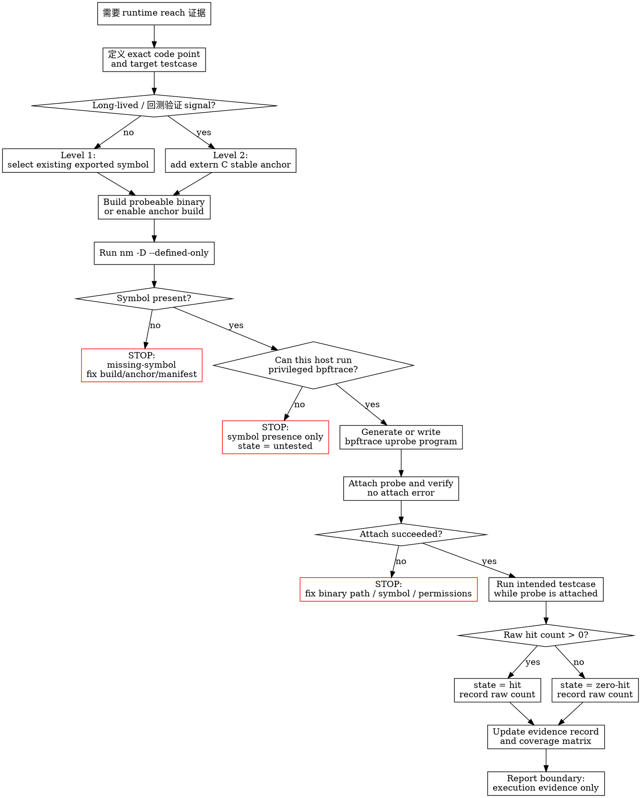

# cn_verify_testcase_runtime_reach

## Required Tools（先运行）

进入 `Flow` 前，先检查当前 host 是否具备必要工具，并把检查结果写入
evidence record。缺少 `bpftrace` 时，只能做 symbol-presence check；这不能证明
runtime reach。

| Tool / package | 用途 | Existence check |
|---|---|---|
| Linux with uprobe support | `bpftrace` uprobe attach | `test "$(uname -s)" = Linux` |
| `bpftrace` | 采集 runtime hit count | `command -v bpftrace && bpftrace --version` |
| `binutils` (`nm`, `c++filt`) | symbol export check 和 demangle | `command -v nm && command -v c++filt` |
| C/C++ build tools | 构建 probeable debug 或 anchor-enabled binary | `command -v c++ || command -v clang++` |
| `sudo` 或 equivalent tracing capability | 大多数 host attach uprobe 需要权限 | `sudo -n true 2>/dev/null && echo sudo-ok || echo sudo-required` |
| `rg` 或 `grep` | 过滤 symbol list | `command -v rg || command -v grep` |

常见 Linux packages：`bpftrace`、`binutils`、`ripgrep`，以及 C++ build stack，
例如 `build-essential` 或 `gcc-c++`，再加上项目自己的 build system。

先运行下面的检查，并把结果贴进 evidence record：

```bash
for tool in bpftrace nm c++filt rg grep c++ clang++; do
  if command -v "$tool" >/dev/null 2>&1; then
    printf 'present %s %s\n' "$tool" "$(command -v "$tool")"
  else
    printf 'missing %s\n' "$tool"
  fi
done
printf 'kernel %s %s\n' "$(uname -s)" "$(uname -r)"
sudo -n true >/dev/null 2>&1 && echo 'present sudo-noninteractive' || echo 'missing sudo-noninteractive'
```

## Overview

使用 `bpftrace` 的 uprobe 证明某个 testcase 或 workload 是否到达指定的 C/C++
symbol 或 explicit trace anchor。一次 `hit` 只能证明执行流到达该 probe point；
它不能证明 behavior correctness、完整 branch coverage、export success，也不能证明
end-to-end semantics。

<HARD-GATE>
在 evidence record 包含以下内容之前，不要声称代码 “covered”、“reached” 或
“executed”：

- binary path 和 probe symbol
- `nm -D --defined-only` 输出，证明 symbol exists
- exact bpftrace program 或 generated probe file
- 运行目标 testcase/workload 后得到的 raw hit count
- 每个 probe 的 state：`hit`、`zero-hit`、`missing-symbol` 或 `untested`
</HARD-GATE>

如果当前 host 不能运行 privileged `bpftrace`，就在 symbol-presence evidence 处
STOP。不要从 `nm`、测试通过/失败、log 或 source reading 推断 runtime reach。

## Red Flags

出现这些 Red Flags 时，说明你正准备 overclaim：

- “测试通过了，所以肯定执行到了这里。”
- “symbol exists，所以 runtime coverage 已经证明了。”
- “只是 quick check，可以不保存 raw hit count。”
- “demangled C++ name 可以直接 attach。”
- “没有输出大概就是 zero-hit。”必须先确认 attach succeeded。
- “optimized C++ internal symbols 足够稳定，可以放进回测验证流程。”

## Prompt Strategy Stack

应用这个 skill 时，使用下面这些 prompt strategies。它们适合这个 workflow，因为这里是
evidence-gated agent task，不是 creative writing，也不是 multiple-choice task。

| Strategy | 在这里怎么用 | 作用 |
|---|---|---|
| Layered Prompt | 按 `Goal -> Required tools -> Graph node -> Evidence -> Output format` 组织。 | 保持调查顺序，避免规则混杂。 |
| Flipped Interaction | 如果缺少 code point、testcase、binary path 或 permission context，先问最多 3 个具体问题。 | 避免 trace 错 symbol 或 workload。 |
| ReAct + Prompt Chaining | 每个 graph node 都按 “decide -> act -> observe -> follow next edge”。 | 让 tool output 和 graph state 绑定。 |
| Symbolic Placeholder | final evidence block 必须放在 `<<<runtime_reach_evidence>>>` 和 `<<<end_runtime_reach_evidence>>>` 之间。 | 方便 parse 和 review。 |
| Self-Contrast | verdict 前列出可能推翻 runtime reach 的 evidence：missing symbol、no bpftrace、attach error、zero-hit、wrong testcase。 | 防止 overclaim。 |
| Prompt Repetition | 在 final block 里重复 boundary：`runtime reach only; not semantic correctness`。 | 在报告节点再次强化最容易被破坏的规则。 |

不要在这个 skill 里使用会削弱 evidence discipline 的 prompt techniques。Temp-Decay
Sampling、creative brainstorming、Option-First MCQ、hidden Chain-of-Thought 都不适合这里。
如果用户要求解释 reasoning，只总结 observable evidence 和 branch choice，不输出 private reasoning。

final output 使用这个 shape：

```text
<<<runtime_reach_evidence>>>
goal: <code point and testcase>
tools: <present/missing summary>
path: <graph path taken>
symbol: <binary + symbol>
nm_result: <present|missing>
bpftrace_result: <hit count | attach error | unavailable>
state: <hit|zero-hit|missing-symbol|untested>
disconfirming_evidence: <evidence that could weaken the claim>
boundary: runtime reach only; not semantic correctness
<<<end_runtime_reach_evidence>>>
```

## Flow

这张 Flow graph 不是示意图，而是必须遵守的 execution order。从 `需要 runtime reach
证据` 开始。每个 box node 完成并产生 evidence 后，才能沿着 outgoing edge 继续。
每个 diamond node 只能根据 observed evidence 选择一条 labeled edge。如果 path 到达
red `STOP` node，就在该 terminal state 停止并报告结果；不要继续推断后面的 runtime
reach claim。只有已经产生 evidence 的 graph node，才能在 Graph Checklist 中勾选。



**不要跳过 graph nodes。不要从 “symbol present” 直接推断 runtime reach；必须经过
privileged bpftrace branch。不要在 terminal state 成为 `hit`、`zero-hit`、
`missing-symbol` 或 `untested` 之前报告 coverage。**

## Graph Checklist

把上面的 graph 当作 checklist。每完成一个 node，都记录对应 evidence：

- [ ] `Define exact code point`：source location、binary、symbol、testcase。
- [ ] `Level 1` or `Level 2`：decision reason。
- [ ] `Build probeable binary`：build command 或 anchor build flag。
- [ ] `Run nm -D --defined-only`：captured symbol-presence evidence。
- [ ] `Can this host run privileged bpftrace?`：yes/no 和 host constraint。
- [ ] `Generate or write bpftrace`：exact program 或 generated file path。
- [ ] `Attach probe`：attach success 或 failure output。
- [ ] `Run intended testcase`：exact command。
- [ ] `Raw hit count`：raw bpftrace output。
- [ ] `Update evidence record`：每个 probe 的 final state。
- [ ] `Report boundary`：说明这只证明 runtime reach，不证明 correctness。

## Decision

| Need | Method | 适用场景 |
|---|---|---|
| One-off exploration | Level 1: attach existing exported symbol | 快速本地实验 |
| Durable coverage signal | Level 2: add explicit `extern "C"` anchor | 回测验证、跨分支检查 |

原则：one-off exploration 挂 existing symbols；reliable coverage 使用 explicit anchors，并像
public API 一样测试它们。

## Level 1: Existing Symbols

先构建 probeable binary：

```bash
CXXFLAGS="-O0 -g3 -fno-inline -fno-omit-frame-pointer"
LDFLAGS="-Wl,--export-dynamic"  # for executable symbols when needed
```

查找 attachable symbols。可以用 demangled name 阅读，但实际 attach 时使用 binary 里的
exact symbol name，除非该 symbol 本身就是 `extern "C"`：

```bash
nm -D --defined-only /abs/path/libtarget.so | rg 'symbol_or_mangled_name'
nm -D --defined-only /abs/path/libtarget.so | c++filt | rg 'Class::method'
```

Attach uprobe，在另一个 shell 里运行 testcase，然后停止 `bpftrace`：

```bash
sudo bpftrace -e 'uprobe:/abs/path/libtarget.so:target_symbol { @hits["target_symbol"] = count(); }'
```

Level 1 只适合 quick exploration。已有 C++ symbols 可能因为 inline、strip、hidden
visibility、rename、overload 或 build flags 改变而消失。

## Level 2: Stable Anchors

在 native 源文件中定义 anchor function，并在需要证明的 code point 调用它。anchor name
要稳定且可读。

```cpp
#ifdef __cplusplus
#define TRACE_ANCHOR_EXTERN extern "C"
#else
#define TRACE_ANCHOR_EXTERN
#endif

#if defined(__GNUC__) || defined(__clang__)
#define TRACE_ANCHOR_ATTR __attribute__((visibility("default"), noinline, used))
#else
#define TRACE_ANCHOR_ATTR
#endif

TRACE_ANCHOR_EXTERN TRACE_ANCHOR_ATTR
void trace_anchor_module_stage(void) {}
```

如果其他 translation unit 要调用 anchor，就在 header 中声明它。如果 release build 不能
暴露 anchor，就用显式 build flag 保护声明和调用，例如 `ENABLE_BPFTRACE_ANCHORS`，并在
coverage job 中启用该 flag。

使用前先验证 anchor exists：

```bash
nm -D --defined-only /abs/path/libtarget.so | rg -F 'trace_anchor_module_stage'
```

和 Level 1 一样 attach：

```bash
sudo bpftrace -e 'uprobe:/abs/path/libtarget.so:trace_anchor_module_stage { @hits["module.stage"] = count(); }'
```

## Manifest and Evidence

维护一份 manifest，让 symbol relationship 可审计：

```json
{
  "anchors": [
    {
      "id": "module.stage",
      "binary": "build/libtarget.so",
      "symbol": "trace_anchor_module_stage",
      "file": "src/module.cc",
      "module": "module",
      "stage": "stage"
    }
  ]
}
```

从 manifest 生成 bpftrace program，而不是手写每个 probe：

```bpftrace
BEGIN { printf("tracking anchors\n"); }
uprobe:/abs/path/libtarget.so:trace_anchor_module_stage { @hits["module.stage"] = count(); }
END { print(@hits); }
```

输出 coverage matrix 时，用 tests 作为行、anchor IDs 作为列。只有 observed hit 的 probe
才标记为 covered。missing symbols 要和 zero-hit probes 分开标记。

最小 evidence record 应包含：

```json
{
  "testcase": "test_name_or_command",
  "anchor": "module.stage",
  "binary": "/abs/path/libtarget.so",
  "symbol": "trace_anchor_module_stage",
  "symbol_present": true,
  "hits": 3,
  "state": "hit"
}
```

## 回测验证

- 每次回测先构建 probeable debug binary，或启用 anchor build flag。
- 对 manifest 中的每个 symbol 运行 `nm -D --defined-only`；missing 就把该 probe 标记为
  `missing-symbol`，不要继续声称 runtime reach。
- 只有在允许 privileged tracing 的 host 上运行 `bpftrace`；否则本轮回测只保留
  symbol-presence evidence，并把 state 标记为 `untested`。
- 保存 raw hit count、coverage matrix、testcase command 和 graph path，便于和上一轮回测
  对比，暴露 zero-hit regression 或 anchor loss。

## Common Mistakes

| Mistake | Fix |
|---|---|
| 把 uprobe hit 当作 semantic correctness proof | 只说 “this probe point executed” |
| 长期 coverage 依赖 optimized C++ internal symbols | 添加 `extern "C"` anchor |
| 用 `nm -D -C` 看 demangled name，然后挂 demangled name | Attach exact symbol name，或使用 anchor |
| anchor 被 build flag 隐藏，但回测验证 job 没启用 flag | 检查 build options 和 `nm -D` output |
| 把 unrun 或 missing probes 标成 covered | 分开标记 hit、zero-hit、missing-symbol、untested |

## Pressure Scenarios

- Release build 把目标函数 inline：改用 debug/probeable build，或添加 stable anchor。
- Branch rename 改了 C++ method：long-lived checks 应使用 manifest 记录的 `extern "C"` anchor。
- testcase hit 了 anchor 但后续失败：结果只是 execution evidence，不是 runtime verdict。
- 回测验证 host 不能运行 privileged tracing：symbol-presence check 仍能捕捉 anchor 丢失，hit collection
  移到合适的 host 上。
