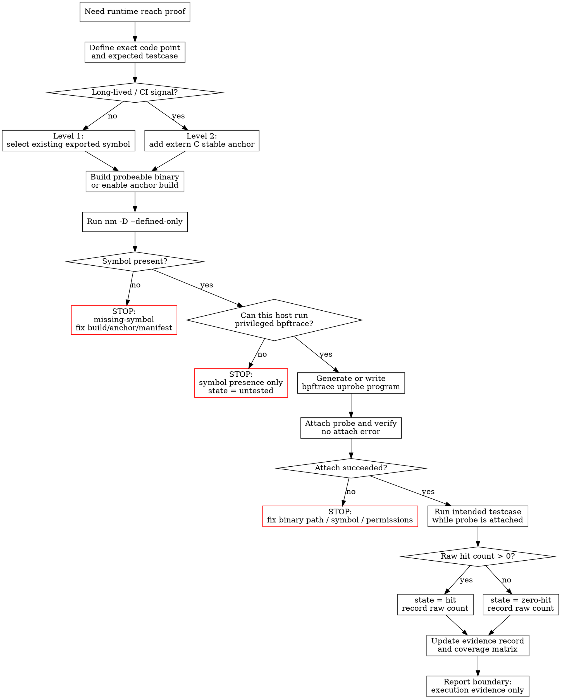

# verify_testcase_runtime_reach

## Required Tools (Run First)

Before following the flow, check which required host tools exist and record the
result. Missing `bpftrace` means you may do symbol-presence checks only; it does
not prove runtime reach.

| Tool / package | Needed for | Existence check |
|---|---|---|
| Linux with uprobe support | `bpftrace` uprobe attachment | `test "$(uname -s)" = Linux` |
| `bpftrace` | Runtime hit counts | `command -v bpftrace && bpftrace --version` |
| `binutils` (`nm`, `c++filt`) | Exported symbol checks and demangling | `command -v nm && command -v c++filt` |
| C/C++ build tools | Probeable debug or anchor-enabled builds | `command -v c++ || command -v clang++` |
| `sudo` or equivalent tracing capability | Attaching uprobes on most hosts | `sudo -n true 2>/dev/null && echo sudo-ok || echo sudo-required` |
| `rg` or `grep` | Filtering symbol lists | `command -v rg || command -v grep` |

Common Linux packages: `bpftrace`, `binutils`, `ripgrep`, and a C++ build stack
such as `build-essential` or `gcc-c++` plus the project's build system.

Run this first and paste the result into the evidence record:

```bash
for tool in bpftrace nm c++filt rg grep c++ clang++; do
  if command -v "$tool" >/dev/null 2>&1; then
    printf 'present %s %s\n' "$tool" "$(command -v "$tool")"
  else
    printf 'missing %s\n' "$tool"
  fi
done
printf 'kernel %s %s\n' "$(uname -s)" "$(uname -r)"
sudo -n true >/dev/null 2>&1 && echo 'present sudo-noninteractive' || echo 'missing sudo-noninteractive'
```

## Overview

Use `bpftrace` uprobes to prove that a test or workload reached a specific
C/C++ symbol or explicit trace anchor. A hit proves execution reached that probe
point; it does not prove behavior correctness, full branch coverage, export
success, or end-to-end semantics.

<HARD-GATE>
Do NOT claim "covered", "reached", or "executed" until the evidence record has:

- the binary path and probe symbol
- `nm -D --defined-only` output proving the symbol exists
- the exact bpftrace program or generated probe file
- raw hit counts from running the intended testcase or workload
- a state for every probe: `hit`, `zero-hit`, `missing-symbol`, or `untested`
</HARD-GATE>

If the host cannot run privileged `bpftrace`, STOP at symbol-presence evidence.
Do not infer runtime reach from `nm`, test pass/fail status, logs, or source code.

## Red Flags

These thoughts mean you are about to overclaim:

- "The test passed, so it must have reached this code."
- "The symbol exists, so runtime coverage is proven."
- "This is just a quick check; I can skip the raw hit count."
- "A demangled C++ name is good enough to attach to."
- "Zero output probably means zero hits." Verify attach success separately.
- "Existing optimized C++ symbols are stable enough for CI."

## Prompt Strategy Stack

Use these prompt strategies together when applying this skill. They are selected
because this workflow is an evidence-gated agent task, not a creative writing or
multiple-choice task.

| Strategy | How to use it here | Why |
|---|---|---|
| Layered Prompt | State `Goal -> Required tools -> Graph node -> Evidence -> Output format`. | Keeps the investigation ordered and prevents rule mixing. |
| Flipped Interaction | If code point, testcase, binary, or permission context is missing, ask up to 3 concrete questions before tracing. | Avoids tracing the wrong symbol or workload. |
| ReAct + Prompt Chaining | For each graph node: decide the next action, run the command, record the observation, then follow the next edge. | Keeps tool output tied to the graph state. |
| Symbolic Placeholder | Put the final evidence block between `<<<runtime_reach_evidence>>>` and `<<<end_runtime_reach_evidence>>>`. | Makes the verdict easy to parse and review. |
| Self-Contrast | Before the verdict, list evidence that could disprove runtime reach: missing symbol, no bpftrace, attach error, zero hits, wrong testcase. | Prevents overclaiming. |
| Prompt Repetition | Repeat the boundary in the final block: `runtime reach only; not semantic correctness`. | Reinforces the hardest rule at the point of reporting. |

Do not use prompt techniques that weaken evidence discipline here. Temperature
changes, creative brainstorming, option-first MCQ, or hidden chain-of-thought are
not useful for this skill. If the user asks for reasoning, summarize observable
evidence and decisions, not private reasoning.

Use this final output shape:

```text
<<<runtime_reach_evidence>>>
goal: <code point and testcase>
tools: <present/missing summary>
path: <graph path taken>
symbol: <binary + symbol>
nm_result: <present|missing>
bpftrace_result: <hit count | attach error | unavailable>
state: <hit|zero-hit|missing-symbol|untested>
disconfirming_evidence: <what could undermine the claim>
boundary: runtime reach only; not semantic correctness
<<<end_runtime_reach_evidence>>>
```

## Flow

Read this graph as the required execution order, not as an illustration. Start at
`Need runtime reach proof`. Complete each box before following its outgoing edge.
At each diamond, choose exactly one labeled edge based on observed evidence. If a
path reaches a red `STOP` node, stop there and report that terminal state; do not
continue to later runtime-reach claims. Only graph nodes that have produced
evidence may be checked off in the Graph Checklist.



**Do NOT skip graph nodes. Do NOT proceed from symbol presence to runtime reach
without the privileged bpftrace branch. Do NOT report coverage until the terminal
state is `hit`, `zero-hit`, `missing-symbol`, or `untested`.**

## Graph Checklist

Use the graph as the checklist. Track each completed node with its evidence:

- [ ] `Define exact code point`: source location, binary, symbol, testcase.
- [ ] `Level 1` or `Level 2`: decision reason.
- [ ] `Build probeable binary`: build command or anchor build flag.
- [ ] `Run nm -D --defined-only`: captured symbol-present evidence.
- [ ] `Can this host run privileged bpftrace?`: yes/no and host constraint.
- [ ] `Generate or write bpftrace`: exact program or generated file path.
- [ ] `Attach probe`: attach success or failure output.
- [ ] `Run intended testcase`: exact command.
- [ ] `Raw hit count`: raw bpftrace output.
- [ ] `Update evidence record`: final state for every probe.
- [ ] `Report boundary`: state that this proves reach only, not correctness.

## Decision

| Need | Method | Use for |
|---|---|---|
| One-off exploration | Level 1: attach to existing exported symbols | Fast local experiments |
| Durable coverage signal | Level 2: add explicit `extern "C"` anchors | CI, cross-branch checks |

Rule: one-off exploration attaches to existing symbols; reliable coverage uses
explicit anchors and tests them like public APIs.

## Level 1: Existing Symbols

Build for probeability:

```bash
CXXFLAGS="-O0 -g3 -fno-inline -fno-omit-frame-pointer"
LDFLAGS="-Wl,--export-dynamic"  # for executable symbols when needed
```

Find attachable symbols. Use demangling for reading, but attach with the exact
symbol name from the binary unless using an `extern "C"` symbol:

```bash
nm -D --defined-only /abs/path/libtarget.so | rg 'symbol_or_mangled_name'
nm -D --defined-only /abs/path/libtarget.so | c++filt | rg 'Class::method'
```

Attach a uprobe, run the testcase in another shell, then stop `bpftrace`:

```bash
sudo bpftrace -e 'uprobe:/abs/path/libtarget.so:target_symbol { @hits["target_symbol"] = count(); }'
```

Use Level 1 for exploration only. Existing C++ symbols can disappear when code
is inlined, stripped, hidden, renamed, overloaded, or built with different
flags.

## Level 2: Stable Anchors

Define anchors once in a native source file and call them at the code points you
want to prove. Keep names stable and descriptive.

```cpp
#ifdef __cplusplus
#define TRACE_ANCHOR_EXTERN extern "C"
#else
#define TRACE_ANCHOR_EXTERN
#endif

#if defined(__GNUC__) || defined(__clang__)
#define TRACE_ANCHOR_ATTR __attribute__((visibility("default"), noinline, used))
#else
#define TRACE_ANCHOR_ATTR
#endif

TRACE_ANCHOR_EXTERN TRACE_ANCHOR_ATTR
void trace_anchor_module_stage(void) {}
```

Declare the function in a header if other translation units call it. If release
builds must not expose anchors, gate both declarations and calls behind an
explicit build option such as `ENABLE_BPFTRACE_ANCHORS`, and run the coverage
job with that option enabled.

Verify the anchor exists before using it:

```bash
nm -D --defined-only /abs/path/libtarget.so | rg -F 'trace_anchor_module_stage'
```

Attach exactly as for Level 1:

```bash
sudo bpftrace -e 'uprobe:/abs/path/libtarget.so:trace_anchor_module_stage { @hits["module.stage"] = count(); }'
```

## Manifest and Evidence

Maintain a manifest so symbols remain auditable:

```json
{
  "anchors": [
    {
      "id": "module.stage",
      "binary": "build/libtarget.so",
      "symbol": "trace_anchor_module_stage",
      "file": "src/module.cc",
      "module": "module",
      "stage": "stage"
    }
  ]
}
```

Generate bpftrace from the manifest rather than hand-writing probes:

```bpftrace
BEGIN { printf("tracking anchors\n"); }
uprobe:/abs/path/libtarget.so:trace_anchor_module_stage { @hits["module.stage"] = count(); }
END { print(@hits); }
```

Report a coverage matrix with tests as rows and anchor IDs as columns. Mark only
observed hits as covered. Mark missing symbols separately from zero-hit probes.

A minimal evidence record should include:

```json
{
  "testcase": "test_name_or_command",
  "anchor": "module.stage",
  "binary": "/abs/path/libtarget.so",
  "symbol": "trace_anchor_module_stage",
  "symbol_present": true,
  "hits": 3,
  "state": "hit"
}
```

## CI Checks

- Build a probeable debug or anchor-enabled binary.
- For every manifest symbol, run `nm -D --defined-only` and fail if it is
  missing.
- Run privileged `bpftrace` jobs only on hosts where that is allowed; otherwise
  keep CI to symbol-presence checks and run hit collection in a dedicated job.
- Store raw hit counts and the matrix so zero-hit regressions are visible.

## Common Mistakes

| Mistake | Fix |
|---|---|
| Treating a uprobe hit as semantic proof | Say only "this probe point executed" |
| Attaching to optimized C++ internals for long-term coverage | Add `extern "C"` anchors |
| Checking `nm -D -C` output, then attaching to the demangled name | Attach to the exact symbol or use anchors |
| Hiding anchors behind build flags without enabling them in CI | Verify the build option and `nm -D` output |
| Coloring unrun or missing probes as covered | Separate hit, zero-hit, missing-symbol, and untested states |

## Pressure Scenarios

- Release build inlines the target function: use a debug/probeable build or a
  stable anchor.
- Branch rename changes a C++ method: prefer manifest-backed `extern "C"`
  anchors for long-lived checks.
- A test hits the anchor but still fails later: report execution evidence, not a
  runtime verdict.
- CI cannot run privileged tracing: symbol-presence checks still catch anchor
  loss, while hit collection moves to a suitable host.
