# verify_testcase_runtime_reach

## Overview

Use `bpftrace` uprobes to prove that a test or workload reached a specific
C/C++ symbol or explicit trace anchor. A hit proves execution reached that probe
point; it does not prove behavior correctness, full branch coverage, export
success, or end-to-end semantics.

<HARD-GATE>
Do NOT claim "covered", "reached", or "executed" until the evidence record has:

- the binary path and probe symbol
- `nm -D --defined-only` output proving the symbol exists
- the exact bpftrace program or generated probe file
- raw hit counts from running the intended testcase or workload
- a state for every probe: `hit`, `zero-hit`, `missing-symbol`, or `untested`
</HARD-GATE>

If the host cannot run privileged `bpftrace`, STOP at symbol-presence evidence.
Do not infer runtime reach from `nm`, test pass/fail status, logs, or source code.

## Red Flags

These thoughts mean you are about to overclaim:

- "The test passed, so it must have reached this code."
- "The symbol exists, so runtime coverage is proven."
- "This is just a quick check; I can skip the raw hit count."
- "A demangled C++ name is good enough to attach to."
- "Zero output probably means zero hits." Verify attach success separately.
- "Existing optimized C++ symbols are stable enough for CI."

## Flow

```dot
digraph runtime_reach {
  rankdir=LR;
  need [label="Need runtime reach proof", shape=box];
  durable [label="Long-lived / CI signal?", shape=diamond];
  level1 [label="Level 1\\nAttach existing symbol", shape=box];
  level2 [label="Level 2\\nAdd extern C anchor", shape=box];
  build [label="Build probeable binary", shape=box];
  nm [label="Verify symbol with nm -D", shape=box];
  trace [label="Run bpftrace + testcase", shape=box];
  classify [label="Classify hit / zero / missing / untested", shape=box];
  report [label="Record evidence + matrix", shape=box];

  need -> durable;
  durable -> level2 [label="yes"];
  durable -> level1 [label="no"];
  level1 -> build;
  level2 -> build;
  build -> nm -> trace -> classify -> report;
}
```



## Checklist

Create a visible checklist for non-trivial investigations:

- [ ] Define the exact code point that must be proven.
- [ ] Choose Level 1 for one-off exploration or Level 2 for durable coverage.
- [ ] Build with probeable flags or enable anchor builds.
- [ ] Verify every probe symbol with `nm -D --defined-only`.
- [ ] Run `bpftrace` while executing the intended testcase or workload.
- [ ] Save raw hit counts and classify every probe state.
- [ ] Report the boundary: execution evidence, not semantic correctness.

## Decision

| Need | Method | Use for |
|---|---|---|
| One-off exploration | Level 1: attach to existing exported symbols | Fast local experiments |
| Durable coverage signal | Level 2: add explicit `extern "C"` anchors | CI, cross-branch checks |

Rule: one-off exploration attaches to existing symbols; reliable coverage uses
explicit anchors and tests them like public APIs.

## Level 1: Existing Symbols

Build for probeability:

```bash
CXXFLAGS="-O0 -g3 -fno-inline -fno-omit-frame-pointer"
LDFLAGS="-Wl,--export-dynamic"  # for executable symbols when needed
```

Find attachable symbols. Use demangling for reading, but attach with the exact
symbol name from the binary unless using an `extern "C"` symbol:

```bash
nm -D --defined-only /abs/path/libtarget.so | rg 'symbol_or_mangled_name'
nm -D --defined-only /abs/path/libtarget.so | c++filt | rg 'Class::method'
```

Attach a uprobe, run the testcase in another shell, then stop `bpftrace`:

```bash
sudo bpftrace -e 'uprobe:/abs/path/libtarget.so:target_symbol { @hits["target_symbol"] = count(); }'
```

Use Level 1 for exploration only. Existing C++ symbols can disappear when code
is inlined, stripped, hidden, renamed, overloaded, or built with different
flags.

## Level 2: Stable Anchors

Define anchors once in a native source file and call them at the code points you
want to prove. Keep names stable and descriptive.

```cpp
#ifdef __cplusplus
#define TRACE_ANCHOR_EXTERN extern "C"
#else
#define TRACE_ANCHOR_EXTERN
#endif

#if defined(__GNUC__) || defined(__clang__)
#define TRACE_ANCHOR_ATTR __attribute__((visibility("default"), noinline, used))
#else
#define TRACE_ANCHOR_ATTR
#endif

TRACE_ANCHOR_EXTERN TRACE_ANCHOR_ATTR
void trace_anchor_module_stage(void) {}
```

Declare the function in a header if other translation units call it. If release
builds must not expose anchors, gate both declarations and calls behind an
explicit build option such as `ENABLE_BPFTRACE_ANCHORS`, and run the coverage
job with that option enabled.

Verify the anchor exists before using it:

```bash
nm -D --defined-only /abs/path/libtarget.so | rg -F 'trace_anchor_module_stage'
```

Attach exactly as for Level 1:

```bash
sudo bpftrace -e 'uprobe:/abs/path/libtarget.so:trace_anchor_module_stage { @hits["module.stage"] = count(); }'
```

## Manifest and Evidence

Maintain a manifest so symbols remain auditable:

```json
{
  "anchors": [
    {
      "id": "module.stage",
      "binary": "build/libtarget.so",
      "symbol": "trace_anchor_module_stage",
      "file": "src/module.cc",
      "module": "module",
      "stage": "stage"
    }
  ]
}
```

Generate bpftrace from the manifest rather than hand-writing probes:

```bpftrace
BEGIN { printf("tracking anchors\n"); }
uprobe:/abs/path/libtarget.so:trace_anchor_module_stage { @hits["module.stage"] = count(); }
END { print(@hits); }
```

Report a coverage matrix with tests as rows and anchor IDs as columns. Mark only
observed hits as covered. Mark missing symbols separately from zero-hit probes.

A minimal evidence record should include:

```json
{
  "testcase": "test_name_or_command",
  "anchor": "module.stage",
  "binary": "/abs/path/libtarget.so",
  "symbol": "trace_anchor_module_stage",
  "symbol_present": true,
  "hits": 3,
  "state": "hit"
}
```

## CI Checks

- Build a probeable debug or anchor-enabled binary.
- For every manifest symbol, run `nm -D --defined-only` and fail if it is
  missing.
- Run privileged `bpftrace` jobs only on hosts where that is allowed; otherwise
  keep CI to symbol-presence checks and run hit collection in a dedicated job.
- Store raw hit counts and the matrix so zero-hit regressions are visible.

## Common Mistakes

| Mistake | Fix |
|---|---|
| Treating a uprobe hit as semantic proof | Say only "this probe point executed" |
| Attaching to optimized C++ internals for long-term coverage | Add `extern "C"` anchors |
| Checking `nm -D -C` output, then attaching to the demangled name | Attach to the exact symbol or use anchors |
| Hiding anchors behind build flags without enabling them in CI | Verify the build option and `nm -D` output |
| Coloring unrun or missing probes as covered | Separate hit, zero-hit, missing-symbol, and untested states |

## Pressure Scenarios

- Release build inlines the target function: use a debug/probeable build or a
  stable anchor.
- Branch rename changes a C++ method: prefer manifest-backed `extern "C"`
  anchors for long-lived checks.
- A test hits the anchor but still fails later: report execution evidence, not a
  runtime verdict.
- CI cannot run privileged tracing: symbol-presence checks still catch anchor
  loss, while hit collection moves to a suitable host.
