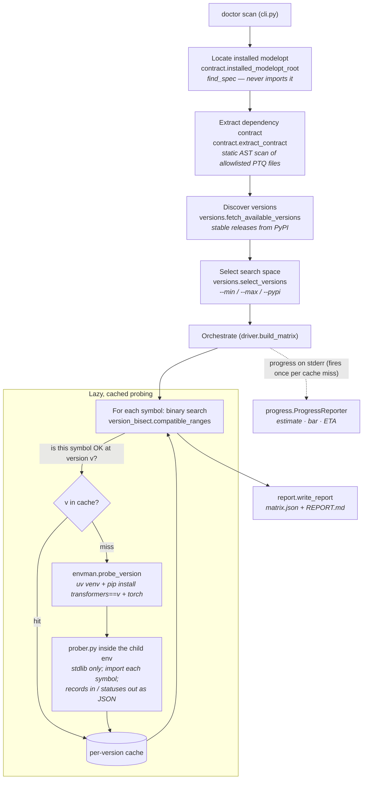
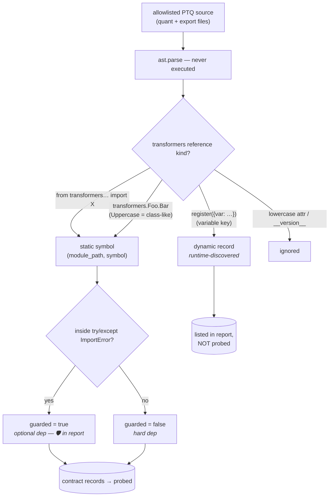
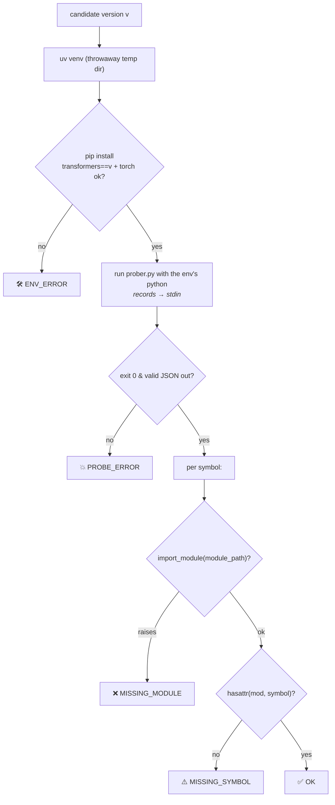
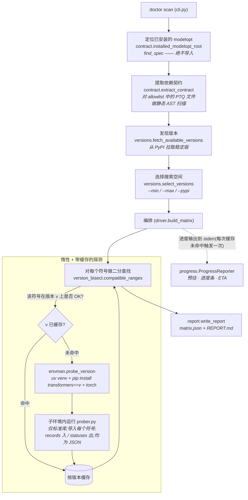
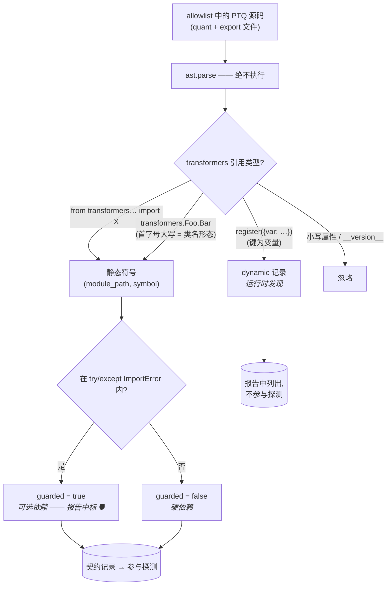
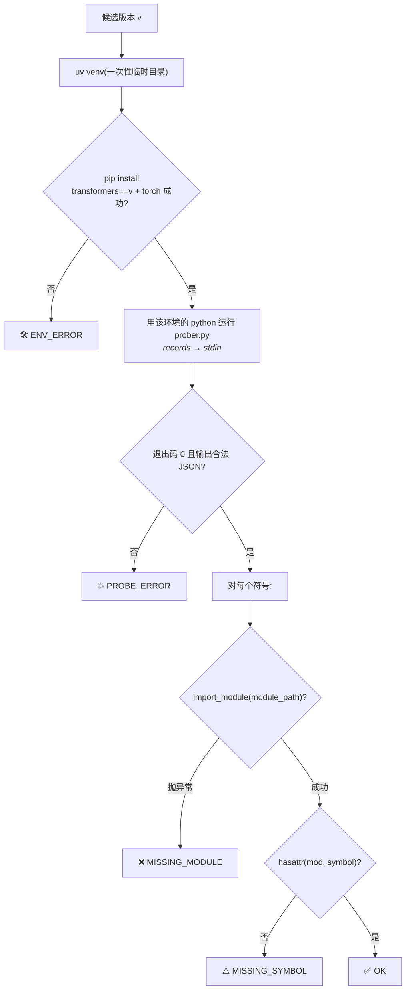

# modelopt-ptq-transformers-doctor

Builds a **compatibility matrix** between [NVIDIA TensorRT Model Optimizer
(modelopt)](https://github.com/NVIDIA/TensorRT-Model-Optimizer) PTQ and the
`transformers` library, by statically extracting the set of `transformers`
symbols that modelopt PTQ depends on and probing each one against a range of
`transformers` releases.

For every dependency symbol it reports the contiguous version window in which
that symbol imports cleanly, so you can answer "which `transformers` versions
does the installed modelopt actually work with?"

## How it works

1. **Locate** — find the modelopt installed in the current environment (via
   `importlib.util.find_spec`, without importing it).
2. **Extract** — static AST scan of modelopt's source collects the
   `transformers.*` imports / attribute accesses that PTQ quant & export code
   relies on (`contract.py`, file list in `allowlist.py`).
3. **Discover** — stable `transformers` releases are fetched from PyPI
   (`versions.py`), optionally filtered to a `--min`/`--max` range.
4. **Probe** — for each candidate version a throwaway [`uv`](https://docs.astral.sh/uv/)
   virtualenv is created, `transformers==<version>` (plus `torch`) is installed,
   and a stdlib-only prober imports each symbol inside that env (`envman.py`,
   `prober.py`). A binary search finds each symbol's compatible window
   (`version_bisect.py`).
5. **Report** — results are written as JSON + Markdown (`report.py`).

> **Trust boundary:** this tool creates virtualenvs and **installs and imports
> third-party packages** (`transformers`, `torch`) to probe them. Importing a
> package executes its code. Run it only against versions/sources you trust.

## Workflow & working principle (graphs)

The whole tool is explained below as four graphs. Core idea: **never import
modelopt or transformers into the tool's own process** — locate and parse
statically, then probe each `transformers` version inside a disposable child
environment.

### 1. End-to-end pipeline

*From `doctor scan` to the report; the inner box is the lazy, cached probe loop.*



### 2. Contract extraction — how each dependency is classified

*`contract.py` parses (never executes) the allowlisted PTQ files and sorts every
`transformers` reference into static / guarded / dynamic.*



### 3. Probing one version — isolation & status

*`envman.probe_version` builds a throwaway env and runs the stdlib-only
`prober.py` under that env's Python; every outcome maps to one status.*



### 4. Bisection & caching — which versions actually get installed

*`build_matrix` drives `version_bisect` per symbol; `is_ok(v)` is served from a
per-version cache, so each version is installed at most once across the scan.*

```mermaid
sequenceDiagram
    participant driver as driver.build_matrix
    participant bisect as version_bisect
    participant cache as per-version cache
    participant env as envman + prober
    driver->>bisect: compatible_ranges(versions, is_ok)
    loop binary search selects a version v
        bisect->>driver: is_ok(v)?
        driver->>cache: probe(v) cached?
        alt hit
            cache-->>driver: cached statuses
        else miss (fires progress)
            driver->>env: probe_version(v)
            env-->>driver: statuses (installs v once)
            driver->>cache: store
        end
        driver-->>bisect: OK / not OK
    end
    bisect-->>driver: compatible window [lo, hi]
    Note over driver,cache: version columns in REPORT.md = the probed sample;<br/>the "compatible" column is the authoritative window
```

> The report (`report.py`) writes `matrix.json` (full) + `REPORT.md`. Guarded
> imports are marked 🛡, dynamic registrations listed separately, and any
> `ENV_ERROR` version is flagged as a caveat (adjacent ranges may be understated).

## Requirements

- Python **>= 3.10**
- **modelopt** installed in the same environment (pulled in automatically as a
  dependency — see Install)
- The [`uv`](https://docs.astral.sh/uv/) executable on `PATH` (used to create
  the per-version probe environments)
- Network access to PyPI (for version discovery and installs)

## Install

Installing this tool pulls in the latest modelopt from GitHub as a dependency:

```bash
pip install git+https://github.com/joe0731/modelopt_ptq_transformers_doctor
```

Or from a checkout:

```bash
pip install .
```

If modelopt is not present at run time, `doctor scan` exits with an explicit
error telling you to install it:

```
pip install git+https://github.com/NVIDIA/Model-Optimizer.git
```

## Usage

The tool scans the **installed** modelopt — no source path is needed:

```bash
# Probe a version range
doctor scan --min 4.45.0 --max 4.52.0 --out doctor-report

# Use the full stable PyPI release list as the search space
doctor scan --pypi --out doctor-report
```

Options:

| flag | meaning |
|---|---|
| `--min VERSION` | minimum `transformers` version, inclusive |
| `--max VERSION` | maximum `transformers` version, inclusive |
| `--pypi` | use the full stable PyPI release list (only when no `--min`/`--max`) |
| `--out DIR` | output directory (default: `doctor-report`) |
| `--no-progress` | disable the live progress bar / ETA (progress is on by default, printed to stderr) |

During a scan, progress is printed to **stderr**: an up-front estimate of the
number of binary-search probes (`~LOW-N`), then a live bar showing the
`transformers` version under test, elapsed time, and an ETA. On a
non-interactive stream (pipe / CI) it logs one line per probed version instead.
Use `--no-progress` to silence it.

Output:

- `doctor-report/matrix.json` — machine-readable matrix
- `doctor-report/REPORT.md` — human-readable matrix; the **compatible** column
  is the authoritative per-symbol version window

## Development

```bash
pip install -e .
pip install pytest
pytest
```

## License

MIT — see [LICENSE](LICENSE).

---

# 中文版(English mirror）

> 以下为上文英文内容的中文镜像,内容保持一致。

# modelopt-ptq-transformers-doctor

构建 [NVIDIA TensorRT Model Optimizer
(modelopt)](https://github.com/NVIDIA/TensorRT-Model-Optimizer) PTQ 与
`transformers` 库之间的**兼容性矩阵**:静态提取 modelopt PTQ 依赖的
`transformers` 符号集合,并在一系列 `transformers` 版本上逐一探测每个符号。

对每个依赖符号,工具会报告它能干净导入的**连续版本区间**,从而回答"当前安装的
modelopt 到底兼容哪些 `transformers` 版本"。

## 工作原理

1. **定位** —— 通过 `importlib.util.find_spec`(不导入)找到当前环境中已安装的
   modelopt。
2. **提取** —— 对 modelopt 源码做静态 AST 扫描,收集 PTQ quant 与 export 代码
   依赖的 `transformers.*` 导入 / 属性访问(`contract.py`,文件清单见
   `allowlist.py`)。
3. **发现** —— 从 PyPI 拉取稳定版 `transformers` 发布列表(`versions.py`),可用
   `--min`/`--max` 过滤区间。
4. **探测** —— 对每个候选版本创建一个一次性的 [`uv`](https://docs.astral.sh/uv/)
   虚拟环境,安装 `transformers==<version>`(及 `torch`),并在该环境中用仅依赖
   标准库的 prober 导入每个符号(`envman.py`、`prober.py`)。二分查找定位每个
   符号的兼容区间(`version_bisect.py`)。
5. **报告** —— 结果输出为 JSON + Markdown(`report.py`)。

> **信任边界:** 本工具会创建虚拟环境并**安装、导入第三方包**(`transformers`、
> `torch`)来探测它们。导入一个包即会执行其代码。请仅对你信任的版本/来源运行。

## 工作流程与工作原理(图解)

整个工具用以下四张图来解释。核心思想:**绝不把 modelopt 或 transformers 导入到
工具自身的进程里** —— 先静态定位与解析,再在一次性的子环境中逐版本探测。

### 1. 端到端流水线

*从 `doctor scan` 到报告;内框是惰性、带缓存的探测循环。*



### 2. 契约提取 —— 每个依赖如何被分类

*`contract.py` 解析(绝不执行)allowlist 中的 PTQ 文件,把每个 `transformers`
引用归类为 静态 / guarded / dynamic。*



### 3. 探测单个版本 —— 隔离与状态判定

*`envman.probe_version` 建一次性环境,用该环境的 Python 运行仅标准库的
`prober.py`;每种结果映射到一个状态。*



### 4. 二分与缓存 —— 实际会安装哪些版本

*`build_matrix` 对每个符号驱动 `version_bisect`;`is_ok(v)` 由按版本缓存提供,
因此整次扫描中每个版本最多只安装一次。*

```mermaid
sequenceDiagram
    participant driver as driver.build_matrix
    participant bisect as version_bisect
    participant cache as 按版本缓存
    participant env as envman + prober
    driver->>bisect: compatible_ranges(versions, is_ok)
    loop 二分查找选中某版本 v
        bisect->>driver: is_ok(v)?
        driver->>cache: probe(v) 已缓存?
        alt 命中
            cache-->>driver: 缓存的 statuses
        else 未命中(触发进度)
            driver->>env: probe_version(v)
            env-->>driver: statuses(只安装一次 v)
            driver->>cache: 写入缓存
        end
        driver-->>bisect: OK / 非 OK
    end
    bisect-->>driver: 兼容区间 [lo, hi]
    Note over driver,cache: REPORT.md 的逐版本列 = 被探测的采样;<br/>"compatible" 列才是权威区间
```

> 报告(`report.py`)写出 `matrix.json`(完整)与 `REPORT.md`。guarded 导入标
> 🛡,dynamic 注册单独列出,任何 `ENV_ERROR` 版本都会被标注为注意事项(其相邻区间
> 可能被低估)。

## 环境要求

- Python **>= 3.10**
- 同一环境中已安装 **modelopt**(作为依赖自动拉取——见"安装")
- `PATH` 中存在 [`uv`](https://docs.astral.sh/uv/) 可执行文件(用于创建各版本的
  探测环境)
- 可访问 PyPI 的网络(用于版本发现与安装)

## 安装

安装本工具会自动从 GitHub 拉取最新的 modelopt 作为依赖:

```bash
pip install git+https://github.com/joe0731/modelopt_ptq_transformers_doctor
```

或从源码检出安装:

```bash
pip install .
```

如果运行时环境中没有 modelopt,`doctor scan` 会以**明确的英文报错**退出,提示你
安装:

```
pip install git+https://github.com/NVIDIA/Model-Optimizer.git
```

## 用法

工具扫描的是**已安装的** modelopt——无需提供源码路径:

```bash
# 探测一个版本区间
doctor scan --min 4.45.0 --max 4.52.0 --out doctor-report

# 用完整的 PyPI 稳定发布列表作为搜索空间
doctor scan --pypi --out doctor-report
```

选项:

| 参数 | 含义 |
|---|---|
| `--min VERSION` | `transformers` 最小版本(含) |
| `--max VERSION` | `transformers` 最大版本(含) |
| `--pypi` | 使用完整的 PyPI 稳定发布列表(仅在没有 `--min`/`--max` 时生效) |
| `--out DIR` | 输出目录(默认:`doctor-report`) |

输出:

- `doctor-report/matrix.json` —— 机器可读矩阵
- `doctor-report/REPORT.md` —— 人类可读矩阵;**compatible** 列是每个符号权威的
  版本区间

## 开发

```bash
pip install -e .
pip install pytest
pytest
```

## 许可证

MIT —— 见 [LICENSE](LICENSE)。
