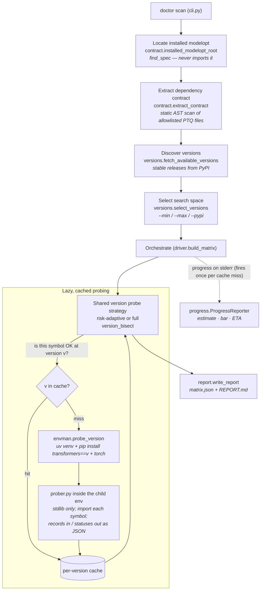
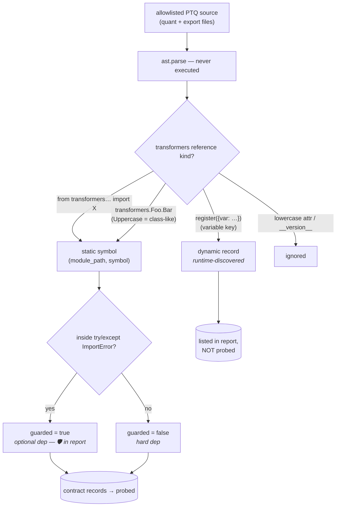
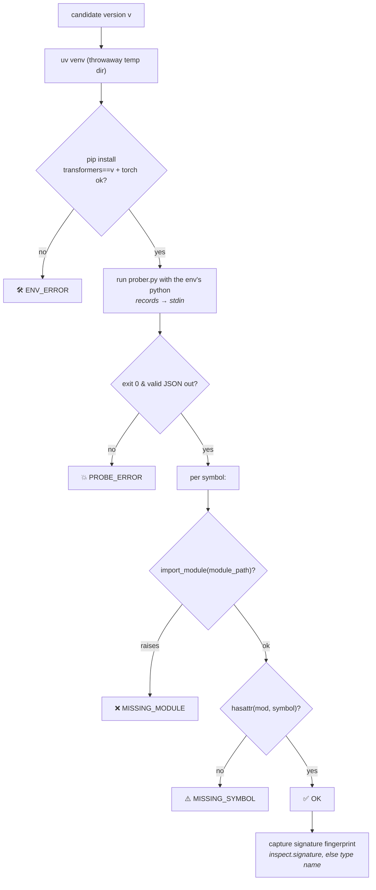
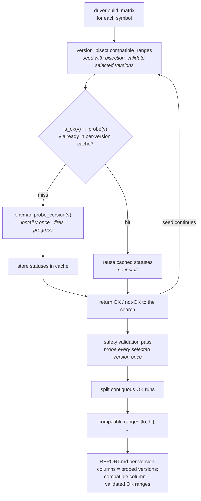
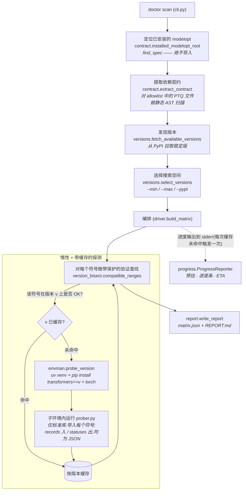
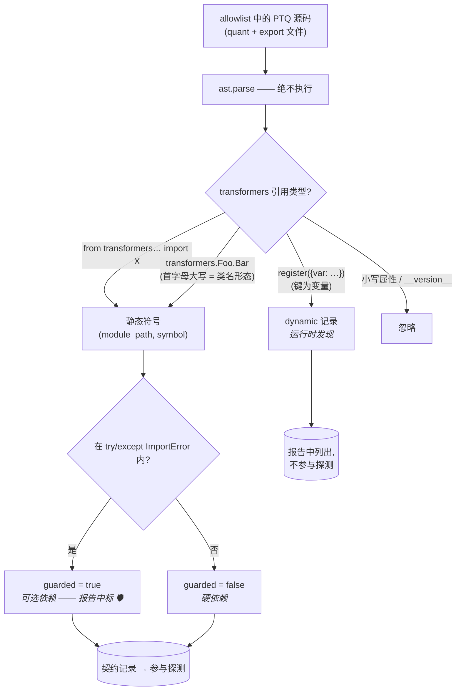
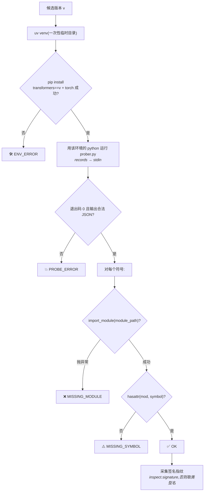
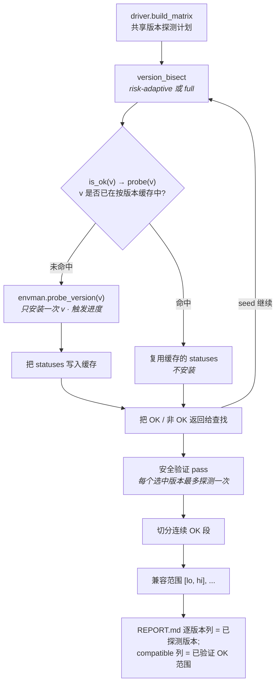

# modelopt-ptq-transformers-doctor

> **Compatibility doctor for the NVIDIA TensorRT Model Optimizer (modelopt) PTQ
> pipeline ↔ its dependency libraries** — HuggingFace Transformers, PyTorch,
> vLLM, accelerate.
> Answers *"which library versions does the installed `modelopt`'s post-training
> quantization (FP8 / NVFP4 / INT4-AWQ) actually work with — across init →
> quantize → export?"* by combining static dependency/API scanning,
> export-capability screening, and a real load → quantize → export smoke probe.
> Output as JSON, Markdown, styled HTML, and notebooks.

**Keywords:** NVIDIA modelopt · TensorRT Model Optimizer · HuggingFace Transformers ·
PyTorch · vLLM · accelerate · post-training quantization (PTQ) ·
FP8 / NVFP4 / INT4-AWQ · LLM quantization · version compatibility matrix · dependency scanner.

modelopt's PTQ pipeline (init / module-replacement → quantization → export)
calls specific APIs of `transformers`, `torch`, `vllm`, and `accelerate` — and
those APIs drift across versions. This tool finds the breakage early.

## What it checks — four layers

| layer | command | answers | runs the model? |
|---|---|---|:--:|
| **Static API scan** | `doctor scan --target <lib>` | which library versions modelopt's PTQ symbols import cleanly against, + **signature drift** | no |
| **Export-capability screening** | `doctor capabilities` | MoE experts modelopt *quantizes* but the export path may not support ("quantizes but won't export") | no |
| **Model-family coverage inventory** | `doctor model-coverage` | which `transformers.models/*` families have explicit ModelOpt PTQ symbols vs structural candidates | no |
| **Runtime smoke probe** | `doctor smoke` · `doctor smoke-matrix` | does the real **load → quantize → export** actually succeed (single, or per version) | yes (GPU) |

Static layers are cheap **bulk screening**; the smoke probe is the **runtime
verdict**. "Imports + signature OK" ≠ "runs OK" — so screening flags candidates
to verify, and the smoke probe proves them. Targets: `transformers` (default),
`torch`, `vllm`, `accelerate` (**SGLang is unsupported** — modelopt has no
sglang integration). For each dependency symbol the scan reports the contiguous
version window where it imports cleanly, plus signature drift.

## How the scan works (static layer)

1. **Locate** — find the modelopt installed in the current environment (via
   `importlib.util.find_spec`, without importing it).
2. **Extract** — static AST scan of modelopt's source collects the
   `transformers.*` imports / attribute accesses that PTQ quant & export code
   relies on (`contract.py`, file list in `allowlist.py`).
3. **Discover** — stable `transformers` releases are fetched from PyPI
   (`versions.py`), optionally filtered to a `--min`/`--max` range.
4. **Probe** — `--strategy risk-adaptive` (default) starts with endpoints,
   quartiles, feature-version edges, known-risk minors, then expands around
   observed status changes; `--strategy full` probes every selected release for
   release reports. Each probed version runs in a throwaway [`uv`](https://docs.astral.sh/uv/)
   virtualenv where the stdlib-only prober imports symbols (`envman.py`,
   `prober.py`).
5. **Report** — results are written as JSON + Markdown (`report.py`).

> **Trust boundary:** this tool creates virtualenvs and **installs and imports
> third-party packages** (`transformers`, `torch`) to probe them. Importing a
> package executes its code. Run it only against versions/sources you trust.

## Workflow & working principle (graphs)

The whole tool is explained below as four graphs. Core idea: **never import
modelopt or transformers into the tool's own process** — locate and parse
statically, then probe each `transformers` version inside a disposable child
environment.

### 1. End-to-end pipeline

*From `doctor scan` to the report; the inner box is the lazy, cached probe loop.*



### 2. Contract extraction — how each dependency is classified

*`contract.py` parses (never executes) the allowlisted PTQ files and sorts every
`transformers` reference into static / guarded / dynamic.*



### 3. Probing one version — isolation & status

*`envman.probe_version` builds a throwaway env and runs the stdlib-only
`prober.py` under that env's Python; every outcome maps to one status, and each
OK symbol also gets a signature fingerprint.*



### 4. Guarded validation & caching — which versions actually get installed

*`build_matrix` drives `version_bisect` per symbol; `is_ok(v)` is served from a
per-version cache, so each version is installed at most once across the scan.
The search uses a binary seed, then validates the selected range before reporting
compatible ranges.*



ASCII strategy workflow (break/fix safe):

```text
Selected releases:  5.8   5.9   5.10  5.11  5.12
Actual outcome:     OK    OK    FAIL  OK    OK

Pure bisection risk:
  1. find an OK anchor around 5.9
  2. search right edge and hit first FAIL at 5.10
  3. report only 5.8-5.9
  4. miss the fixed 5.11-5.12 window

Risk-adaptive strategy used by default:
  1. seed: probe endpoints / quartiles / midpoint
  2. cover: probe first/latest patch in every feature version
  3. risk: fully probe known-risk minors, e.g. transformers 4.56/4.57/5.10
  4. expand: if observed status vectors differ across a gap, probe the midpoint
  5. split: build ranges only from contiguous probed OK runs

Validated quick result: 5.8-5.9, 5.11-5.12 if those points were probed
Full result:            use --strategy full to validate every selected release
N/A rule:               any unprobed version stays N/A; it is never colored OK
```

> The report (`report.py`) writes `matrix.json` (full) + `REPORT.md`. Guarded
> imports are marked 🛡, dynamic registrations listed separately, symbols whose
> signature changed across compatible ranges are marked ⚇ (detailed in a **Signature
> changes** section), and any `ENV_ERROR` version is flagged as a caveat
> (adjacent ranges may be understated).

## Requirements

- Python **>= 3.10**
- **modelopt** installed in the same environment (pulled in automatically as a
  dependency — see Install)
- The [`uv`](https://docs.astral.sh/uv/) executable on `PATH` (used to create
  the per-version probe environments)
- Network access to PyPI (for version discovery and installs)

## Install

Installing this tool pulls in the latest modelopt from GitHub as a dependency:

```bash
pip install git+https://github.com/joe0731/modelopt_ptq_transformers_doctor
```

Or from a checkout:

```bash
pip install .
```

If modelopt is not present at run time, `doctor scan` exits with an explicit
error telling you to install it:

```
pip install git+https://github.com/NVIDIA/Model-Optimizer.git
```

## Usage

The tool scans the **installed** modelopt — no source path is needed:

```bash
# Quick probe transformers across a version range (default: risk-adaptive)
doctor scan --min 4.45.0 --max 4.52.0 --out doctor-report

# Release/report-grade validation: probe every selected version
doctor scan --strategy full --min 4.45.0 --max 4.52.0 --out doctor-report

# Probe a different library modelopt integrates with
doctor scan --target torch       --min 2.1.0 --max 2.8.0
doctor scan --target vllm        --min 0.6.0 --max 0.11.0
doctor scan --target accelerate  --min 1.0.0 --max 1.10.0
```

Options:

| flag | meaning |
|---|---|
| `--target LIB` | library to probe modelopt against: `transformers` (default), `torch`, `vllm`, `accelerate` |
| `--min VERSION` | minimum target version, inclusive |
| `--max VERSION` | maximum target version, inclusive |
| `--pypi` | use the full stable PyPI release list (only when no `--min`/`--max`) |
| `--strategy MODE` | `risk-adaptive` (default quick scan) or `full` (probe every selected version) |
| `--out DIR` | output directory (default: `doctor-report/<target>`) |
| `--no-progress` | disable the live progress bar / ETA (progress is on by default, printed to stderr) |

**Targets.** Each target probes a different library modelopt's PTQ integrates
with, using the same flow and report. When probing one target, the *other*
libraries are held at fixed known-good versions (best-effort isolation) so a
failure is attributable to the varied library. **SGLang is not supported** —
modelopt has no SGLang integration, so there is nothing to probe.

**Combined report.** After scanning several targets into
`report/<dir>/<target>/`, aggregate them into one page:

```bash
python report/render_combined.py report/<dir> --modelopt-version <ver>
# → report/<dir>/index.html + index.ipynb (overview + a section per library)
```

**Export-capability screening (`doctor capabilities`).** A separate static
check that flags MoE expert types modelopt PTQ *quantizes* but that its HF
export path does not explicitly support — the "quantizes but won't export"
class (e.g. NemotronH). It is a **screening signal, not a verdict**: export
support is a runtime predicate (named cases + structural fallbacks), so
candidates must be verified at runtime.

```bash
doctor capabilities            # prints named/fallback/quant-handled experts + candidates to verify
doctor capabilities --out caps.json
```


**Model-family coverage inventory (`doctor model-coverage`).** A static source-tree
scan for the question "Transformers has hundreds of `models/*` families; which
ones does ModelOpt explicitly touch?" It lists every family with `modeling_*.py`,
marks explicit ModelOpt PTQ symbols, and flags structural candidates containing
attention / MoE / linear-like classes. It is a **screening signal, not a verdict**.

```bash
doctor model-coverage --transformers-root /path/to/transformers --out coverage.json
```

**Runtime smoke probe (`doctor smoke`).** The *verdict* layer that static checks
can't give: it runs the real pipeline — **load → quantize → export** — on a
model and reports exactly which stage fails (`LOAD` / `QUANTIZE` / `EXPORT_ERROR`
+ message). This catches both runtime classes: a load-time config
`AttributeError` and an export-time `NotImplementedError` (unsupported MoE
experts). Needs modelopt + transformers + torch installed (a GPU for real
recipes).

```bash
doctor smoke --model <hf-id-or-path> --recipe FP8_DEFAULT_CFG --device cuda
doctor smoke --model <hf-id> --recipe NVFP4_DEFAULT_CFG --trust-remote-code --out smoke.json

# smoke across a target library's versions (runtime counterpart to scan; per-version isolated envs)
doctor smoke-matrix --model <hf-id> --modelopt nvidia-modelopt==0.44.0 \
  --target transformers --min 5.0.0 --max 5.12.1 --recipe FP8_DEFAULT_CFG
```

During a scan, progress is printed to **stderr**: an up-front strategy-specific
probe estimate, then a live bar showing the target version under test, elapsed
time, and an ETA. On a
non-interactive stream (pipe / CI) it logs one line per probed version instead.
Use `--no-progress` to silence it.

Output:

- `doctor-report/matrix.json` — machine-readable matrix (each symbol also
  carries `signatures` per version and a `signature_drift` list)
- `doctor-report/REPORT.md` — human-readable matrix; the **compatible** column
  contains validated per-symbol OK ranges. A `⚇` marks symbols whose
  signature changed across that window, with the transitions listed in a
  **Signature changes** section.

## Development

```bash
pip install -e .
pip install pytest
pytest
```

## Agent skills

This repo ships an agent skill for Claude Code and Codex:

- **`compat-report`** (`.claude/skills/`, `.codex/skills/`) — the end-to-end
  workflow to scan one `nvidia-modelopt` version and render the styled
  compatibility report (`report/render_compat.py`). Tracked in git.

The report styling was designed with the third-party **`ui-ux-pro-max`** design
skill, which is **not** committed (it's vendored). The reports render fully
without it (the CSS is baked into `render_compat.py`); to get the design skill
back for further UI work, install it:

```bash
npm install -g uipro-cli
uipro init --ai claude    # and: uipro init --ai codex
```

## License

MIT — see [LICENSE](LICENSE).

---

# 中文版(English mirror）

> 以下为上文英文内容的中文镜像,内容保持一致。

# modelopt-ptq-transformers-doctor

> **面向 NVIDIA TensorRT Model Optimizer(modelopt)PTQ 流水线 ↔ 其依赖库的兼容性医生**
> —— HuggingFace Transformers、PyTorch、vLLM、accelerate。
> 回答*「当前安装的 `modelopt`,其训练后量化(PTQ:FP8 / NVFP4 / INT4-AWQ)在
> init → quantize → export 全流程上到底兼容哪些库版本?」*—— 结合静态依赖/API 扫描、
> 导出能力筛查、以及真实的 load→quantize→export 冒烟探测。输出 JSON、Markdown、
> 带样式的 HTML 与 notebook。

**关键词:** NVIDIA modelopt · TensorRT Model Optimizer · HuggingFace Transformers ·
PyTorch · vLLM · accelerate · 训练后量化 PTQ · FP8 / NVFP4 / INT4-AWQ · LLM 量化 ·
版本兼容性矩阵 · 依赖扫描。

modelopt 的 PTQ 流水线(init / 模块替换 → 量化 → 导出)会调用 `transformers`、
`torch`、`vllm`、`accelerate` 的具体 API,而这些 API 会随版本漂移。本工具尽早发现这些
不兼容。

## 检查的四个层次

| 层次 | 命令 | 回答 | 是否真跑模型 |
|---|---|---|:--:|
| **静态 API 扫描** | `doctor scan --target <lib>` | modelopt PTQ 符号能在哪些库版本上干净导入,以及**签名漂移** | 否 |
| **导出能力筛查** | `doctor capabilities` | modelopt 能*量化*、但导出路径可能不支持的 MoE experts(「能量化、却导不出」) | 否 |
| **模型族覆盖清单** | `doctor model-coverage` | `transformers.models/*` 中哪些模型族被 ModelOpt 显式依赖,哪些只是结构候选 | 否 |
| **运行时冒烟探测** | `doctor smoke` · `doctor smoke-matrix` | 真实的 **load → quantize → export** 是否成功(单次,或逐版本) | 是(GPU) |

静态层是廉价的**批量筛查**;冒烟探测是**运行时判定**。「能导入 + 签名 OK」≠「能跑」——
所以筛查标记待验证候选,冒烟探测给出实证。目标库:`transformers`(默认)、`torch`、
`vllm`、`accelerate`(**不支持 SGLang**——modelopt 无 sglang 集成)。对每个依赖符号,
扫描报告它能干净导入的连续版本区间,以及签名漂移。

## 工作原理(静态扫描层)

1. **定位** —— 通过 `importlib.util.find_spec`(不导入)找到当前环境中已安装的
   modelopt。
2. **提取** —— 对 modelopt 源码做静态 AST 扫描,收集 PTQ quant 与 export 代码
   依赖的 `transformers.*` 导入 / 属性访问(`contract.py`,文件清单见
   `allowlist.py`)。
3. **发现** —— 从 PyPI 拉取稳定版 `transformers` 发布列表(`versions.py`),可用
   `--min`/`--max` 过滤区间。
4. **探测** —— 对每个候选版本创建一个一次性的 [`uv`](https://docs.astral.sh/uv/)
   虚拟环境,安装 `transformers==<version>`(及 `torch`),并在该环境中用仅依赖
   标准库的 prober 导入每个符号(`envman.py`、`prober.py`)。`version_bisect.py`
   默认 `risk-adaptive`: 先抽样 endpoints/quartiles/feature edges 和高风险 minor,再围绕状态变化扩展;正式报告可用 `--strategy full` 全量验证。
5. **报告** —— 结果输出为 JSON + Markdown(`report.py`)。

> **信任边界:** 本工具会创建虚拟环境并**安装、导入第三方包**(`transformers`、
> `torch`)来探测它们。导入一个包即会执行其代码。请仅对你信任的版本/来源运行。

## 工作流程与工作原理(图解)

整个工具用以下四张图来解释。核心思想:**绝不把 modelopt 或 transformers 导入到
工具自身的进程里** —— 先静态定位与解析,再在一次性的子环境中逐版本探测。

### 1. 端到端流水线

*从 `doctor scan` 到报告;内框是惰性、带缓存的探测循环。*



### 2. 契约提取 —— 每个依赖如何被分类

*`contract.py` 解析(绝不执行)allowlist 中的 PTQ 文件,把每个 `transformers`
引用归类为 静态 / guarded / dynamic。*



### 3. 探测单个版本 —— 隔离与状态判定

*`envman.probe_version` 建一次性环境,用该环境的 Python 运行仅标准库的
`prober.py`;每种结果映射到一个状态,OK 的符号还会采集签名指纹。*



### 4. 带保护的验证查找与缓存 —— 实际会安装哪些版本

*`build_matrix` 对每个符号驱动 `version_bisect`;`is_ok(v)` 由按版本缓存提供,
因此整次扫描中每个版本最多只安装一次。查找先用二分做 seed,再验证选中范围,
最后只用真实探测为 OK 的连续区间生成兼容范围。*



ASCII 策略演示(防止漏掉 break/fix):

```text
选中版本:       5.8   5.9   5.10  5.11  5.12
真实结果:       OK    OK    FAIL  OK    OK

纯二分风险:
  1. 在 5.9 附近找到 OK anchor
  2. 向右找边界时在 5.10 遇到第一个 FAIL
  3. 只报告 5.8-5.9
  4. 漏掉后来修复的 5.11-5.12

当前带保护策略:
  1. seed: 探测端点 / 四分位 / 中点
  2. 左侧: 二分找 anchor 左边的临时 first OK
  3. 右侧: 二分找 anchor 右边的临时 first break
  4. safety pass: 继续验证每个选中版本,全局缓存避免重复安装
  5. split: 只根据真实探测 OK 的连续段生成范围

验证后结果:     5.8-5.9, 5.11-5.12
N/A 规则:       未探测版本保持 N/A,绝不涂成 OK
```

> 报告(`report.py`)写出 `matrix.json`(完整)与 `REPORT.md`。guarded 导入标
> 🛡,dynamic 注册单独列出,签名在兼容范围内变化的符号标 ⚇(并在 **Signature
> changes** 小节列出),任何 `ENV_ERROR` 版本都会被标注为注意事项(其相邻区间
> 可能被低估)。

## 环境要求

- Python **>= 3.10**
- 同一环境中已安装 **modelopt**(作为依赖自动拉取——见"安装")
- `PATH` 中存在 [`uv`](https://docs.astral.sh/uv/) 可执行文件(用于创建各版本的
  探测环境)
- 可访问 PyPI 的网络(用于版本发现与安装)

## 安装

安装本工具会自动从 GitHub 拉取最新的 modelopt 作为依赖:

```bash
pip install git+https://github.com/joe0731/modelopt_ptq_transformers_doctor
```

或从源码检出安装:

```bash
pip install .
```

如果运行时环境中没有 modelopt,`doctor scan` 会以**明确的英文报错**退出,提示你
安装:

```
pip install git+https://github.com/NVIDIA/Model-Optimizer.git
```

## 用法

工具扫描的是**已安装的** modelopt——无需提供源码路径:

```bash
# 快速扫描 transformers 版本区间(默认 risk-adaptive)
doctor scan --min 4.45.0 --max 4.52.0 --out doctor-report

# 正式报告:验证每个选中版本
doctor scan --strategy full --min 4.45.0 --max 4.52.0 --out doctor-report

# 探测 modelopt 集成的其他库
doctor scan --target torch       --min 2.1.0 --max 2.8.0
doctor scan --target vllm        --min 0.6.0 --max 0.11.0
doctor scan --target accelerate  --min 1.0.0 --max 1.10.0
```

选项:

| 参数 | 含义 |
|---|---|
| `--target LIB` | 要对 modelopt 探测的库:`transformers`(默认)、`torch`、`vllm`、`accelerate` |
| `--min VERSION` | 目标库最小版本(含) |
| `--max VERSION` | 目标库最大版本(含) |
| `--pypi` | 使用完整的 PyPI 稳定发布列表(仅在没有 `--min`/`--max` 时生效) |
| `--strategy MODE` | `risk-adaptive`(默认快扫)或 `full`(逐个验证所有选中版本) |
| `--out DIR` | 输出目录(默认:`doctor-report/<target>`) |

**多目标。** 每个 target 用相同的流程与报告探测 modelopt PTQ 集成的不同库。探测某个
target 时,其他库会固定在已知可用的版本(尽力隔离),使失败可归因于被探测的库。
**不支持 SGLang** —— modelopt 没有 SGLang 集成,无可探测内容。

**合并报告。** 把多个 target 扫描到 `report/<dir>/<target>/` 后,聚合成一个页面:

```bash
python report/render_combined.py report/<dir> --modelopt-version <ver>
# → report/<dir>/index.html + index.ipynb(总览 + 每个库一节)
```

**导出能力筛查(`doctor capabilities`)。** 一个独立的静态检查,标记 modelopt PTQ
能**量化**、但其 HF 导出路径未显式支持的 MoE experts 类型——即「能量化、却导不出」
那一类(如 NemotronH)。这是**筛查信号,不是判定**:导出支持是运行时谓词(具名分支
+ 结构化兜底),候选项需在运行时验证。

```bash
doctor capabilities            # 打印 具名/兜底/量化已处理的 experts + 待验证候选
doctor capabilities --out caps.json
```


**模型族覆盖清单(`doctor model-coverage`)。** 静态扫描 transformers 源码树,回答
「Transformers 有很多 `models/*`,哪些被 ModelOpt 显式依赖?」它会列出带
`modeling_*.py` 的模型族,标记 explicit PTQ symbol,并把 attention / MoE /
linear-like 结构标成候选。它是**筛查信号,不是运行 verdict**。

```bash
doctor model-coverage --transformers-root /path/to/transformers --out coverage.json
```

**运行时冒烟探测(`doctor smoke`)。** 静态检查给不了的**判定层**:对一个模型真正跑
**load → quantize → export**,报告具体在哪一步失败(`LOAD` / `QUANTIZE` /
`EXPORT_ERROR` + 信息)。两类运行时问题都能抓:加载期的 config `AttributeError`,
以及导出期的 `NotImplementedError`(不支持的 MoE experts)。需要环境装有 modelopt +
transformers + torch(真实 recipe 需要 GPU)。

```bash
doctor smoke --model <hf-id-or-path> --recipe FP8_DEFAULT_CFG --device cuda
doctor smoke --model <hf-id> --recipe NVFP4_DEFAULT_CFG --trust-remote-code --out smoke.json

# 跨目标库版本做冒烟(scan 的运行时对应物;每版本隔离环境)
doctor smoke-matrix --model <hf-id> --modelopt nvidia-modelopt==0.44.0 \
  --target transformers --min 5.0.0 --max 5.12.1 --recipe FP8_DEFAULT_CFG
```

输出:

- `doctor-report/matrix.json` —— 机器可读矩阵(每个符号还带逐版本 `signatures`
  与 `signature_drift` 列表)
- `doctor-report/REPORT.md` —— 人类可读矩阵;**compatible** 列是每个符号权威的
  版本区间。签名在该区间内变化的符号会标 `⚇`,并在 **Signature changes** 小节
  列出其变化过程。

## 开发

```bash
pip install -e .
pip install pytest
pytest
```

## Agent 技能

本仓库内置一个面向 Claude Code 与 Codex 的 agent skill:

- **`compat-report`**(`.claude/skills/`、`.codex/skills/`)—— 对某个
  `nvidia-modelopt` 版本做扫描并渲染带样式的兼容性报告(`report/render_compat.py`)
  的端到端工作流。已纳入 git。

报告样式借助第三方设计技能 **`ui-ux-pro-max`** 设计完成,但**未提交**(为 vendored
依赖)。没有它报告也能正常渲染(CSS 已内联进 `render_compat.py`);如需该设计技能做
进一步 UI 工作,可安装:

```bash
npm install -g uipro-cli
uipro init --ai claude    # 以及:uipro init --ai codex
```

## 许可证

MIT —— 见 [LICENSE](LICENSE)。
