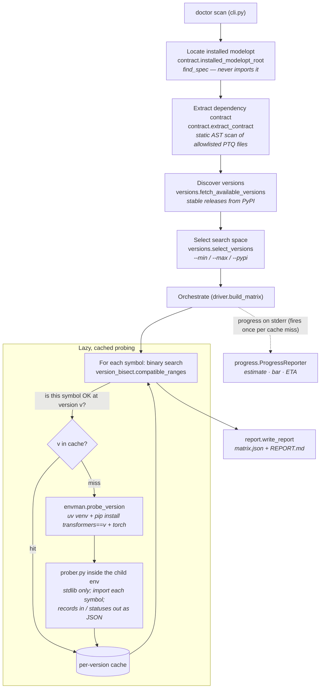
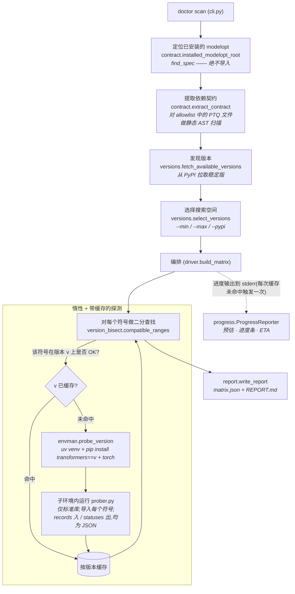

# modelopt-ptq-transformers-doctor

Builds a **compatibility matrix** between [NVIDIA TensorRT Model Optimizer
(modelopt)](https://github.com/NVIDIA/TensorRT-Model-Optimizer) PTQ and the
`transformers` library, by statically extracting the set of `transformers`
symbols that modelopt PTQ depends on and probing each one against a range of
`transformers` releases.

For every dependency symbol it reports the contiguous version window in which
that symbol imports cleanly, so you can answer "which `transformers` versions
does the installed modelopt actually work with?"

## How it works

1. **Locate** — find the modelopt installed in the current environment (via
   `importlib.util.find_spec`, without importing it).
2. **Extract** — static AST scan of modelopt's source collects the
   `transformers.*` imports / attribute accesses that PTQ quant & export code
   relies on (`contract.py`, file list in `allowlist.py`).
3. **Discover** — stable `transformers` releases are fetched from PyPI
   (`versions.py`), optionally filtered to a `--min`/`--max` range.
4. **Probe** — for each candidate version a throwaway [`uv`](https://docs.astral.sh/uv/)
   virtualenv is created, `transformers==<version>` (plus `torch`) is installed,
   and a stdlib-only prober imports each symbol inside that env (`envman.py`,
   `prober.py`). A binary search finds each symbol's compatible window
   (`version_bisect.py`).
5. **Report** — results are written as JSON + Markdown (`report.py`).

> **Trust boundary:** this tool creates virtualenvs and **installs and imports
> third-party packages** (`transformers`, `torch`) to probe them. Importing a
> package executes its code. Run it only against versions/sources you trust.

## Workflow graph



## Working principle

The pipeline is built around one idea: **never import modelopt or transformers
into the tool's own process** — locate and parse statically, then probe each
`transformers` version inside a disposable child environment.

1. **Locate without importing** (`contract.py`). `importlib.util.find_spec`
   resolves where modelopt lives and returns its root directory. modelopt is
   never imported, so the tool never pulls torch into its own process.
2. **Static contract extraction** (`contract.py` + `allowlist.py`). Only the
   allowlisted PTQ **quant** and **export** source files are parsed (never
   executed). The AST visitor records three kinds of dependency:
   - `from transformers[...] import X` and `transformers.Foo.Bar` attribute
     chains (class-like names — first letter uppercase),
   - imports wrapped in `try/except ImportError` are flagged **guarded**
     (optional — failing is often acceptable),
   - `register({var: ...})` calls with a variable key are flagged **dynamic**
     (runtime-discovered, not statically checkable — listed, not probed).
3. **Version discovery** (`versions.py`). The PyPI JSON API yields every stable
   `transformers` release (pre/dev releases skipped); `--min`/`--max` filter the
   range, or `--pypi` takes the whole list.
4. **Isolated probing** (`envman.py` + `prober.py`). Each candidate version gets
   a throwaway `uv` venv with `transformers==<v>` + `torch` installed. The
   stdlib-only `prober.py` is copied into a neutral temp dir and run by **that
   env's** Python: it receives the contract records as JSON on stdin, imports
   each module, checks `hasattr` for each symbol, and returns per-symbol
   statuses on stdout (`OK` / `MISSING_MODULE` / `MISSING_SYMBOL`; the env layer
   adds `ENV_ERROR` / `PROBE_ERROR` for build/run failures).
5. **Bisection + caching** (`driver.py` + `version_bisect.py`). Probing is
   lazy: each symbol's compatible window is found by binary search (anchor
   sampling + edge searches), assuming a single contiguous OK window. Every
   probe result is **cached per version**, so a full scan installs each version
   at most once — which is why the report's per-version columns are a *sample*
   of the range, while the **compatible** column is the authoritative window.
6. **Progress** (`progress.py`). The reporter fires once per *unique* install
   (cache miss only), printing an up-front probe estimate then a live bar + ETA
   to stderr. It is wrapped so a reporter/stream error can never abort a scan.
7. **Report** (`report.py`). Results are written as `matrix.json` (full) and
   `REPORT.md` (human-readable); guarded imports are marked 🛡, dynamic
   registrations listed separately, and any `ENV_ERROR` versions are flagged as
   caveats since ranges adjacent to them may be understated.

## Requirements

- Python **>= 3.10**
- **modelopt** installed in the same environment (pulled in automatically as a
  dependency — see Install)
- The [`uv`](https://docs.astral.sh/uv/) executable on `PATH` (used to create
  the per-version probe environments)
- Network access to PyPI (for version discovery and installs)

## Install

Installing this tool pulls in the latest modelopt from GitHub as a dependency:

```bash
pip install git+https://github.com/joe0731/modelopt_ptq_transformers_doctor
```

Or from a checkout:

```bash
pip install .
```

If modelopt is not present at run time, `doctor scan` exits with an explicit
error telling you to install it:

```
pip install git+https://github.com/NVIDIA/Model-Optimizer.git
```

## Usage

The tool scans the **installed** modelopt — no source path is needed:

```bash
# Probe a version range
doctor scan --min 4.45.0 --max 4.52.0 --out doctor-report

# Use the full stable PyPI release list as the search space
doctor scan --pypi --out doctor-report
```

Options:

| flag | meaning |
|---|---|
| `--min VERSION` | minimum `transformers` version, inclusive |
| `--max VERSION` | maximum `transformers` version, inclusive |
| `--pypi` | use the full stable PyPI release list (only when no `--min`/`--max`) |
| `--out DIR` | output directory (default: `doctor-report`) |
| `--no-progress` | disable the live progress bar / ETA (progress is on by default, printed to stderr) |

During a scan, progress is printed to **stderr**: an up-front estimate of the
number of binary-search probes (`~LOW-N`), then a live bar showing the
`transformers` version under test, elapsed time, and an ETA. On a
non-interactive stream (pipe / CI) it logs one line per probed version instead.
Use `--no-progress` to silence it.

Output:

- `doctor-report/matrix.json` — machine-readable matrix
- `doctor-report/REPORT.md` — human-readable matrix; the **compatible** column
  is the authoritative per-symbol version window

## Development

```bash
pip install -e .
pip install pytest
pytest
```

## License

MIT — see [LICENSE](LICENSE).

---

# 中文版(English mirror）

> 以下为上文英文内容的中文镜像,内容保持一致。

# modelopt-ptq-transformers-doctor

构建 [NVIDIA TensorRT Model Optimizer
(modelopt)](https://github.com/NVIDIA/TensorRT-Model-Optimizer) PTQ 与
`transformers` 库之间的**兼容性矩阵**:静态提取 modelopt PTQ 依赖的
`transformers` 符号集合,并在一系列 `transformers` 版本上逐一探测每个符号。

对每个依赖符号,工具会报告它能干净导入的**连续版本区间**,从而回答"当前安装的
modelopt 到底兼容哪些 `transformers` 版本"。

## 工作原理

1. **定位** —— 通过 `importlib.util.find_spec`(不导入)找到当前环境中已安装的
   modelopt。
2. **提取** —— 对 modelopt 源码做静态 AST 扫描,收集 PTQ quant 与 export 代码
   依赖的 `transformers.*` 导入 / 属性访问(`contract.py`,文件清单见
   `allowlist.py`)。
3. **发现** —— 从 PyPI 拉取稳定版 `transformers` 发布列表(`versions.py`),可用
   `--min`/`--max` 过滤区间。
4. **探测** —— 对每个候选版本创建一个一次性的 [`uv`](https://docs.astral.sh/uv/)
   虚拟环境,安装 `transformers==<version>`(及 `torch`),并在该环境中用仅依赖
   标准库的 prober 导入每个符号(`envman.py`、`prober.py`)。二分查找定位每个
   符号的兼容区间(`version_bisect.py`)。
5. **报告** —— 结果输出为 JSON + Markdown(`report.py`)。

> **信任边界:** 本工具会创建虚拟环境并**安装、导入第三方包**(`transformers`、
> `torch`)来探测它们。导入一个包即会执行其代码。请仅对你信任的版本/来源运行。

## 工作流程图



## 工作原理

整条流水线围绕一个核心思想:**绝不把 modelopt 或 transformers 导入到工具自身的
进程里** —— 先静态定位与解析,再在一次性的子环境中逐版本探测。

1. **定位但不导入**(`contract.py`)。用 `importlib.util.find_spec` 解析 modelopt
   的位置并返回其根目录,全程不导入 modelopt,因此不会把 torch 拉进工具自身进程。
2. **静态契约提取**(`contract.py` + `allowlist.py`)。仅解析(而非执行)
   allowlist 中的 PTQ **quant** 与 **export** 源文件。AST 访问器记录三类依赖:
   - `from transformers[...] import X` 以及 `transformers.Foo.Bar` 属性链(类名
     形态——首字母大写),
   - 被 `try/except ImportError` 包裹的导入标记为 **guarded**(可选——失败通常可
     接受),
   - 键为变量的 `register({var: ...})` 调用标记为 **dynamic**(运行时发现,无法
     静态检查——只列出,不探测)。
3. **版本发现**(`versions.py`)。通过 PyPI JSON API 获取全部稳定版 `transformers`
   发布(跳过 pre/dev);用 `--min`/`--max` 过滤区间,或用 `--pypi` 取整张列表。
4. **隔离探测**(`envman.py` + `prober.py`)。每个候选版本都创建一次性的 `uv`
   虚拟环境,安装 `transformers==<v>` + `torch`。仅依赖标准库的 `prober.py` 被复制
   到中立临时目录,由**该环境的** Python 运行:它从 stdin 读入 JSON 形式的契约
   记录,导入每个模块,对每个符号检查 `hasattr`,再把各符号状态以 JSON 写到
   stdout(`OK` / `MISSING_MODULE` / `MISSING_SYMBOL`;环境层另加 `ENV_ERROR` /
   `PROBE_ERROR` 表示构建/运行失败)。
5. **二分 + 缓存**(`driver.py` + `version_bisect.py`)。探测是惰性的:每个符号的
   兼容区间用二分查找定位(锚点采样 + 边界查找),并假设兼容区间是单段连续的。每个
   探测结果都**按版本缓存**,因此一次完整扫描对每个版本最多只安装一次——这也是为什么
   报告里的逐版本列只是区间的*采样*,而 **compatible** 列才是权威区间。
6. **进度**(`progress.py`)。报告器在每次*唯一*安装(仅缓存未命中)时触发一次,先
   打印探测次数预估,再向 stderr 输出实时进度条 + ETA。它被包裹保护,报告器/流的
   异常绝不会中断扫描。
7. **报告**(`report.py`)。结果写成 `matrix.json`(完整)与 `REPORT.md`(人类
   可读);guarded 导入标 🛡,dynamic 注册单独列出,任何 `ENV_ERROR` 版本都会被标注
   为注意事项,因为其相邻区间可能被低估。

## 环境要求

- Python **>= 3.10**
- 同一环境中已安装 **modelopt**(作为依赖自动拉取——见"安装")
- `PATH` 中存在 [`uv`](https://docs.astral.sh/uv/) 可执行文件(用于创建各版本的
  探测环境)
- 可访问 PyPI 的网络(用于版本发现与安装)

## 安装

安装本工具会自动从 GitHub 拉取最新的 modelopt 作为依赖:

```bash
pip install git+https://github.com/joe0731/modelopt_ptq_transformers_doctor
```

或从源码检出安装:

```bash
pip install .
```

如果运行时环境中没有 modelopt,`doctor scan` 会以**明确的英文报错**退出,提示你
安装:

```
pip install git+https://github.com/NVIDIA/Model-Optimizer.git
```

## 用法

工具扫描的是**已安装的** modelopt——无需提供源码路径:

```bash
# 探测一个版本区间
doctor scan --min 4.45.0 --max 4.52.0 --out doctor-report

# 用完整的 PyPI 稳定发布列表作为搜索空间
doctor scan --pypi --out doctor-report
```

选项:

| 参数 | 含义 |
|---|---|
| `--min VERSION` | `transformers` 最小版本(含) |
| `--max VERSION` | `transformers` 最大版本(含) |
| `--pypi` | 使用完整的 PyPI 稳定发布列表(仅在没有 `--min`/`--max` 时生效) |
| `--out DIR` | 输出目录(默认:`doctor-report`) |

输出:

- `doctor-report/matrix.json` —— 机器可读矩阵
- `doctor-report/REPORT.md` —— 人类可读矩阵;**compatible** 列是每个符号权威的
  版本区间

## 开发

```bash
pip install -e .
pip install pytest
pytest
```

## 许可证

MIT —— 见 [LICENSE](LICENSE)。
